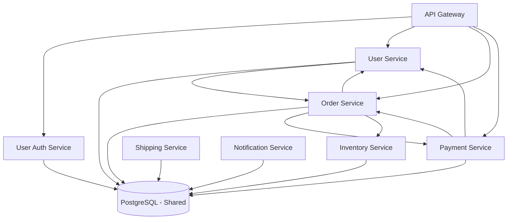

# Mock Archaeologist Output - Microservices System

## 02-subsystem-catalog.md (Excerpt)

### Service: User Authentication Service

**Location:** `services/user-auth/`

**Responsibility:** Handle user login, registration, and session management

**Key Components:**
- `src/auth/login_handler.py` - Login endpoint
- `src/auth/session_manager.py` - Session storage (uses main DB)
- `src/auth/password_hasher.py` - Password hashing (bcrypt)

**Dependencies:**
- Inbound: API Gateway, User Service, Order Service, Payment Service
- Outbound: PostgreSQL (main database), Redis (sessions)

**Patterns Observed:**
- Direct database access to main PostgreSQL database
- REST endpoints called by multiple services
- Session data stored in shared DB

**Concerns:**
- Shares database with 13 other services
- No service boundary enforcement
- Other services bypass this and implement their own auth

**Confidence:** High - clear code structure, well-documented

---

### Service: Order Service

**Location:** `services/orders/`

**Responsibility:** Manage customer orders

**Key Components:**
- `src/order/create_order.py` - Order creation
- `src/order/auth.py` - **Duplicate authentication logic**
- `src/order/db_client.py` - Direct DB access

**Dependencies:**
- Inbound: API Gateway, User Service
- Outbound: PostgreSQL (main database), User Service (REST), Payment Service (REST), Inventory Service (REST)

**Patterns Observed:**
- Direct database access to same tables as other services
- Synchronous REST calls to other services
- Hard-coded service URLs in config file
- Implements own authentication instead of using User Auth Service

**Concerns:**
- Circular dependency with User Service
- No transaction management across services
- Service URLs hard-coded (not discovered)

**Confidence:** High

---

### (Similar patterns for 12 more services...)

## 03-diagrams.md (Excerpt)

### Container Diagram (C4 Level 2)

**Description:** 14 microservices, all accessing shared PostgreSQL database. Services call each other directly via REST APIs, creating tight coupling and circular dependencies.

**Concerns:**
- Distributed monolith pattern detected
- No service isolation
- Circular dependencies prevent independent deployment
- Shared database defeats microservices benefits

## Summary of Key Findings

**Architecture Style:** Attempted microservices, implemented distributed monolith

**Major Patterns:**
- 14 services, all sharing one PostgreSQL database
- Business logic duplicated across 8 services (especially auth logic - 6 implementations)
- Direct REST calls between services (no event bus)
- Hard-coded service URLs in 12 configuration files
- No API versioning
- No circuit breakers or retry logic

**Dependencies:**
- 23 direct service-to-service REST calls
- 7 circular dependency pairs
- All services couple to shared database schema

**Technology Stack:**
- Python 3.9, Flask
- PostgreSQL (single instance)
- Redis (sessions only)
- No message queue
- No service mesh
- Docker containers, deployed via shell scripts
