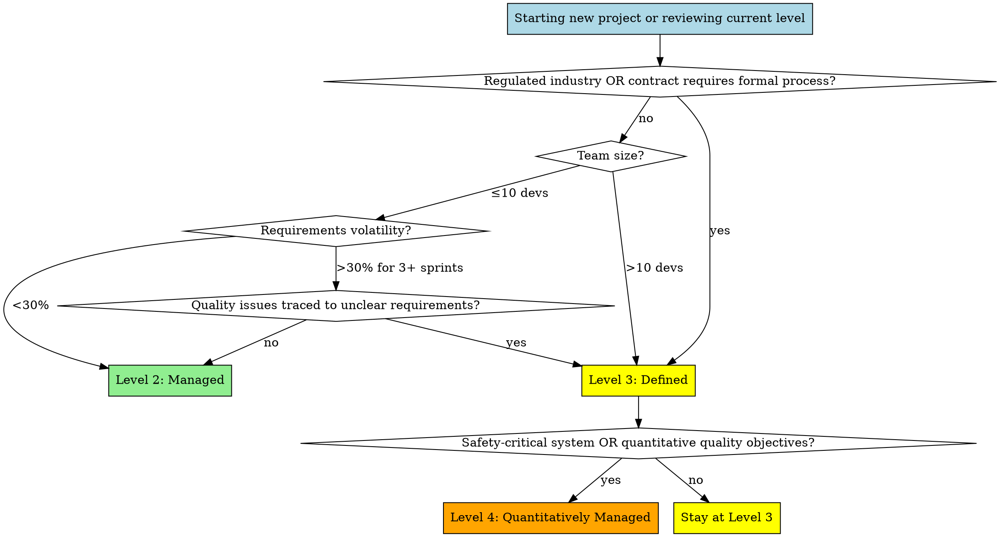

# Level 2→3→4 Scaling Reference

**Parent Skill:** requirements-lifecycle
**When to Use:** Determining appropriate maturity level, scaling practices up or down

This reference shows how requirements practices scale across CMMI maturity levels.

---

## Purpose & Context

**What this achieves**: Right-sized requirements practices matched to project context, avoiding both under-documentation (chaos) and over-documentation (bureaucracy).

**When to apply**:
- New project starting: need to determine appropriate level
- Escalation decision: current level causing quality issues
- De-escalation decision: current level feels like bureaucracy with no value
- Compliance requirement imposed (regulated industry)
- Team size changing (2 → 20 developers)

**Prerequisites**:
- Understanding of CMMI maturity levels (Level 2 = Managed, Level 3 = Defined, Level 4 = Quantitatively Managed)
- Clear picture of project constraints (team size, regulatory requirements, timeline, budget)

---

## Level Comparison Table

### Complete L2 vs L3 vs L4 Comparison

| Practice Area | Level 2: Managed | Level 3: Defined | Level 4: Quantitatively Managed |
|---------------|------------------|------------------|----------------------------------|
| **Elicitation** | Informal interviews, ad-hoc stakeholder identification | Structured workshops (JAD), stakeholder analysis (power/interest matrix), prototyping | Data-driven elicitation, A/B testing, quantitative user research, discovery rate metrics |
| **Analysis** | Simple prioritization (Must/Should/Could), informal conflict resolution | MoSCoW with enforcement rules, formal conflict resolution (decision criteria matrices), completeness checklists | Prioritization with ROI calculations, historical defect analysis, predictive conflict detection |
| **Specification** | User stories + acceptance criteria (3-5 per story) | Organizational templates, use cases for complex flows, peer review with checklist, traceability IDs (REQ-XXX-NNN) | Specification quality metrics (defect density <5%, clarity <10%, testability 100%), SPC tracking |
| **Traceability** | Platform-native linking (GitHub #123, commit messages) | Tool-based RTM generation, bidirectional verification queries, orphaned test detection | Automated coverage metrics (>95%), trend analysis, traceability gap prediction |
| **Change Management** | Issue comments for approval, manual change count, >30% threshold | Formal change requests, impact analysis checklist, multi-party approval matrix, >20% threshold | Volatility control charts (SPC), quantitative approval criteria, prediction models, >15% threshold |
| **Documentation Overhead** | 3-5% project time (12-20 hrs/2-week sprint, 5-person team) | 10-15% project time (40-60 hrs/2-week sprint, 5-person team) | 15-20% project time (60-80 hrs/2-week sprint, 5-person team) |
| **Review Process** | Optional/informal (sprint planning review) | Mandatory peer review with checklist, documented findings | Metrics-tracked reviews (defects found/hour, escape rate to implementation) |
| **Audit Trail** | Issue history, commit messages, PR links | Formal requirements baseline, version-controlled specs, traceability reports | Compliance dashboards, automated audit trail generation, metrics trending |
| **Work Products** | User stories in issue tracker, acceptance criteria, inline comments | Organizational templates (SRS, use cases), requirements management plan, stakeholder register, RTM | Quality metrics dashboards, volatility control charts, predictive models, compliance reports |

---

## Detailed Level Breakdowns

### Level 2: Managed (Project-Specific)

**Philosophy**: "Good enough for most projects, minimal overhead"

**Core Principle**: Requirements are managed **at the project level** using lightweight, tool-supported processes. No organizational standards required.

**Requirements Practices**:
- **User stories** as primary format (As a X, I want Y, so that Z)
- **3-5 acceptance criteria** per story (testable conditions)
- **Platform-assigned IDs** (GitHub #123, Azure DevOps AB#456)
- **Inline traceability** (commit messages reference #123)
- **Issue comment approvals** for changes
- **Manual volatility tracking** (count changes per sprint)

**Work Products**:
```
Typical Level 2 Sprint:
- 8-12 user stories (GitHub Issues/Azure DevOps work items)
- Each story: Title, description (user story format), acceptance criteria (3-5 bullets), priority (MoSCoW), effort (story points)
- Total documentation: 2-4 pages of text (if printed)
- Traceability: Commit messages "Implements #123", PR descriptions "Closes #123"
- Change tracking: Issue comments "@product-owner approved change to #123 on 2026-01-20"
```

**Audit Trail**:
- Issue history shows requirement creation, modifications, closures
- Git log shows which commits implement which requirements
- PR descriptions link implementation to requirements
- No separate RTM document needed (query platform instead)

**Effort**:
- **3-5% of project time**
- Example: 2-week sprint, 5 developers = 400 hours total
- Requirements overhead: **12-20 hours** (product owner + team)
  - 4 hours: Sprint planning (refining stories)
  - 6 hours: During sprint (clarifying, approving changes)
  - 2 hours: Sprint review (demo against acceptance criteria)

**Team Size**: Works for **2-10 developers**

**When Level 2 Works**:
- ✅ Team <10 developers (everyone fits in one room)
- ✅ Single product owner available (no complex stakeholder conflicts)
- ✅ Non-regulated industry (no compliance mandates)
- ✅ Requirements relatively stable (<30% change per sprint)
- ✅ Low project risk (failure doesn't cause harm/financial loss)

**When Level 2 Fails**:
- ❌ Requirements constantly changing (>30% volatility for 3+ sprints)
- ❌ Quality defects traced to ambiguous requirements
- ❌ Team >10 developers (coordination overhead increases)
- ❌ Multiple stakeholders with conflicting needs
- ❌ Audit/compliance requirement imposed

### Level 3: Defined (Organizational Standards)

**Philosophy**: "Consistent, repeatable, organizationally standardized"

**Core Principle**: Requirements are managed using **organizational standards** that apply across all projects. Processes are defined, documented, and followed.

**What Changes from Level 2**:
- **Organizational templates** replace ad-hoc formats (every project uses same user story template)
- **Peer review** becomes mandatory (not optional)
- **Semantic traceability IDs** assigned (REQ-AUTH-042, not just #123)
- **Formal change requests** with multi-party approval
- **Tool-based traceability** (RTM generated via queries, not manual)
- **Systematic volatility tracking** (monthly reports, not ad-hoc)

**Requirements Practices**:
- **Organizational template** for user stories (includes fields beyond Level 2: Rationale, Source, Dependencies, Non-Functional Requirements)
- **Use cases** for complex workflows (Main Flow, Alternative Flows, Exception Flows)
- **Traceability IDs** semantic and stable (REQ-COMPONENT-NUMBER format)
- **Peer review checklist** applied before approval
- **Formal change requests** (CR-YEAR-NUMBER template)
- **Impact analysis checklist** for all changes
- **Multi-party approval matrix** (Product Owner + Tech Lead + QA Lead for moderate/major changes)

**Work Products**:
```
Typical Level 3 Sprint:
- 8-12 user stories (organizational template compliance)
- Requirements Management Plan (one-time, 5-10 pages)
  - Defines traceability ID format (REQ-XXX-NNN)
  - Approval authority matrix
  - Change request workflow
- Stakeholder Register (maintained throughout project)
- Peer Review Records (checklist results documented)
- RTM (generated via tool query, not maintained manually)
- Volatility Report (monthly, 1-2 pages)
```

**Audit Trail**:
- All Level 2 artifacts PLUS:
- Peer review checklists with findings and resolution
- Formal change request documents (CR-YEAR-NUMBER)
- Requirements baseline versions (v1.0, v1.1, etc.)
- Stakeholder approval records

**Effort**:
- **10-15% of project time**
- Example: 2-week sprint, 5 developers = 400 hours total
- Requirements overhead: **40-60 hours**
  - 10 hours: Sprint planning (template compliance, peer review)
  - 15 hours: During sprint (formal change requests, impact analysis)
  - 5 hours: Sprint review + retrospective (metrics review)
  - 10 hours: Documentation (requirements updates, RTM generation)

**Team Size**: Works for **10-30 developers**

**When to Escalate from L2 → L3**:
- ✅ **Audit/compliance requirement** (contract or regulation mandates formal process)
- ✅ **Team size >10 developers** (coordination needs increase)
- ✅ **Regulatory industry** (medical devices, financial systems, aerospace, defense)
- ✅ **Requirements volatility causing quality issues** (>30% change rate for 3+ sprints, defects traced to unclear requirements)
- ✅ **Multiple conflicting stakeholders** (VPs fighting over priorities, need formal resolution process)
- ✅ **Organizational initiative** (company standardizing on Level 3 for all projects)

**When Level 3 Fails**:
- ❌ Process feels bureaucratic (team complains about overhead, velocity drops significantly)
- ❌ Templates filled out mechanically (no value, just compliance theater)
- ❌ Quality not improving despite overhead (defect rate unchanged)
- ❌ Team size remains small (<5 developers) with no regulatory requirement

### Level 4: Quantitatively Managed (Statistical Control)

**Philosophy**: "Measure, control, predict"

**Core Principle**: Requirements processes are **statistically controlled**. Metrics drive decisions, trends predict outcomes, processes are optimized based on data.

**What Changes from Level 3**:
- **Quality metrics tracked** for all requirements activities (defect density, clarity score, testability %)
- **Statistical Process Control (SPC)** applied to volatility (control charts, UCL/LCL)
- **Prediction models** used for estimation (historical effort vs. actual, volatility trends)
- **Quantitative approval criteria** (auto-approve if effort <0.5 days AND volatility <20%)
- **Automated metrics dashboards** (real-time visibility into requirements quality)

**Requirements Practices**:
- All Level 3 practices PLUS:
- **Specification quality metrics**: Defect density <5%, Completeness >95%, Clarity score <10% requiring clarification
- **Volatility control charts**: Track change rate over time, identify out-of-control signals (>UCL)
- **Effort prediction models**: Based on historical data (similar requirements averaged 3.2 days ± 1.1 days)
- **Traceability coverage metrics**: Automated calculation (>95% requirements traced)
- **Quantitative goals**: Each project has numerical quality objectives (e.g., "volatility <10%")

**Work Products**:
```
Typical Level 4 Sprint:
- All Level 3 work products PLUS:
- Requirements Quality Dashboard (automated, real-time)
  - Specification metrics (defect density, completeness, clarity)
  - Traceability coverage (%, orphaned tests)
  - Volatility control chart (current sprint vs. baselines)
- Predictive Analysis Report (monthly, 2-3 pages)
  - Trend analysis (volatility increasing/decreasing?)
  - Effort prediction vs. actual (are estimates accurate?)
  - Process capability (are we meeting quantitative goals?)
- Process Improvement Proposals (when SPC signals out-of-control)
```

**Audit Trail**:
- All Level 3 artifacts PLUS:
- Automated metrics collection logs
- Control chart history (with annotations for out-of-control points)
- Root cause analysis documents (for SPC violations)
- Process improvement action items and results

**Effort**:
- **15-20% of project time**
- Example: 2-week sprint, 5 developers = 400 hours total
- Requirements overhead: **60-80 hours**
  - 15 hours: Sprint planning (all Level 3 activities + metrics review)
  - 20 hours: During sprint (change requests + metrics tracking)
  - 10 hours: Sprint review/retrospective (metrics analysis, trend review)
  - 15 hours: Documentation + reporting (dashboards, control charts, prediction models)

**Team Size**: Can support **30+ developers** (or critical/safety systems with smaller teams)

**When to Escalate from L3 → L4**:
- ✅ **Quantitative quality objectives required** (contract specifies "defect density <X%")
- ✅ **Safety-critical system** (failure causes harm: medical devices, aviation, nuclear)
- ✅ **Process improvement needs data** (organization wants to optimize requirements process, reduce waste)
- ✅ **Very large team** (30+ developers, need statistical visibility)
- ✅ **CMMI Level 4 appraisal** (organizational initiative to achieve maturity level 4)

**When Level 4 Fails**:
- ❌ Data collected but not used (metrics dashboard exists, no one looks at it)
- ❌ Process intervention not triggered (SPC violations ignored)
- ❌ Team doesn't understand metrics (confusion about what control chart means)
- ❌ Overhead outweighs benefit (20% overhead but quality not improving)

---

## Escalation Decision Tree



---

## De-Escalation Criteria

**When to move from Level 3 → Level 2**:

| Indicator | Threshold | Action |
|-----------|-----------|--------|
| **Team complaints** | "Process feels bureaucratic" for 2+ sprints | Review process value, consider simplification |
| **Velocity drop** | Sprint velocity decreased >20% after Level 3 adoption | Evaluate overhead vs. benefit |
| **Template compliance theater** | Teams filling out templates mechanically with no value | Simplify templates or revert to Level 2 |
| **No quality improvement** | Defect rate unchanged after 3+ months at Level 3 | Level 3 overhead not justified, consider Level 2 |
| **Team size decreased** | Team shrunk from >10 to <5 developers | Level 3 coordination overhead no longer needed |
| **Regulatory requirement removed** | Contract changed, no longer requires formal process | Can safely de-escalate if other factors support it |

**When to move from Level 4 → Level 3**:

| Indicator | Threshold | Action |
|-----------|-----------|--------|
| **Metrics not used** | Dashboards exist but decisions not data-driven for 2+ months | Metrics overhead not justified |
| **SPC violations ignored** | Out-of-control signals occur, no process intervention triggered | Level 4 discipline not practiced |
| **Prediction models inaccurate** | Historical data doesn't predict future (±50% error) | Insufficient data or unstable process |
| **Team doesn't understand metrics** | Frequent questions about what control chart means | Training gap, or Level 4 inappropriate for team maturity |

---

## Regulated Industry Guidance (FDA, SOX, DO-178C)

**Addressing Gap**: How to apply CMMI levels to regulated contexts with specific compliance requirements.

### FDA Medical Device Software (21 CFR Part 820, IEC 62304)

**Regulatory Framework**:
- FDA classifies medical devices by risk: Class I (low), Class II (moderate), Class III (high)
- IEC 62304 defines software lifecycle requirements (A, B, C safety classes)
- 21 CFR Part 820 requires design controls, traceability, change control

**CMMI Level Mapping**:

| FDA Class | IEC 62304 Class | Minimum CMMI Level | Rationale |
|-----------|----------------|-------------------|-----------|
| **Class I** (tongue depressors) | Class A (no injury) | **Level 2** acceptable | Low risk, basic traceability sufficient |
| **Class II** (infusion pumps) | Class B (minor injury) | **Level 3** recommended | 510(k) clearance requires formal traceability |
| **Class III** (pacemakers) | Class C (death/serious injury) | **Level 3-4** required | PMA approval, statistical control may be needed |

**Required CMMI Practices for FDA Compliance**:

```
FDA 21 CFR Part 820 Requirement → CMMI Practice

Design Input (§820.30(c)):
  → Requirements Elicitation (Level 2+)
  → Stakeholder identification and needs analysis

Design Output (§820.30(d)):
  → Requirements Specification (Level 2+)
  → Acceptance criteria, testable requirements

Design Verification (§820.30(f)):
  → Requirements Traceability (Level 3)
  → REQ-ID linking to tests (bidirectional)

Design Validation (§820.30(g)):
  → User acceptance testing against requirements

Design Changes (§820.30(i)):
  → Requirements Change Management (Level 3)
  → Formal change requests, impact analysis, approval

Traceability (§820.65):
  → Bidirectional RTM (Level 3)
  → Requirements → Design → Code → Tests → Validation
```

**Small Team Exception** (Addresses Gap D):

If you have <10 developers AND FDA-regulated:

**Minimum Viable Level 3** (Small Regulated Team):
- ✅ **Must Have**: Traceability IDs (REQ-COMPONENT-NNN format)
- ✅ **Must Have**: Formal change requests (CR-YEAR-NNN)
- ✅ **Must Have**: Impact analysis for all changes
- ✅ **Must Have**: Multi-party approval for moderate/major changes
- ⚠️ **Can Tailor**: Peer review (high-risk requirements only, not all)
- ⚠️ **Can Tailor**: Organizational templates (GitHub issue templates = acceptable, don't need formal SRS)
- ⚠️ **Can Tailor**: Monthly volatility reports (sprint-by-sprint acceptable for small team)

**Rationale**: FDA requires **specific practices** (traceability, change control), not **all CMMI Level 3 practices**. Small teams can adopt FDA-mandated practices without full Level 3 overhead.

**Documentation**: Create "FDA-Tailored Level 3" approach document stating:
- Which Level 3 practices adopted (must-haves above)
- Which practices tailored (peer review frequency, template format)
- Rationale: Team size (N developers) + FDA Class II device
- Escalation trigger: If team grows >10 developers, adopt full Level 3

### Financial Compliance (SOX, PCI-DSS, SOC 2)

**Regulatory Focus**: Access control, audit trails, change management, segregation of duties

**CMMI Level Mapping**:

| Compliance | Focus Area | Minimum CMMI Level | Key Practices |
|------------|-----------|-------------------|---------------|
| **SOX** (Sarbanes-Oxley) | Financial reporting controls | **Level 3** | Change approval (segregation), audit trail |
| **PCI-DSS** (Payment cards) | Data security, change management | **Level 3** | Change authorization, testing before production |
| **SOC 2** (Trust Services) | Security, availability, confidentiality | **Level 3** | Change management, incident response |

**Difference from FDA**: Financial compliance focuses on **controls** (who can approve), FDA focuses on **validation** (does it work correctly).

### Aerospace (DO-178C)

**Regulatory Framework**: Software Considerations in Airborne Systems and Equipment Certification

**CMMI Level Mapping**:

| DO-178C Level | Software Criticality | Minimum CMMI Level | Rationale |
|---------------|---------------------|-------------------|-----------|
| **Level A** | Catastrophic (failure causes crash) | **Level 4** required | Statistical control, formal verification |
| **Level B** | Hazardous (serious injury) | **Level 3-4** | Formal traceability, quantitative goals |
| **Level C** | Major (reduced safety margins) | **Level 3** | Formal requirements, traceability |
| **Level D/E** | Minor/No effect | **Level 2** acceptable | Basic requirements management |

**Note**: DO-178C explicitly requires **bidirectional traceability** (requirements ↔ design ↔ code ↔ tests) for Levels A-C.

### Cherry-Picking Practices: When Is It Acceptable? (Addresses Gap A)

**Question**: Can we adopt specific Level 3 practices without full Level 3?

**Answer**: **YES, during transition OR for small regulated teams.**

**Acceptable "Hybrid" Approaches**:

**Scenario 1: Progressive Enhancement (Any Team)**
- Month 1-2: Level 2 + Traceability IDs
- Month 3-4: Level 2 + Traceability IDs + Formal Change Requests
- Month 5-6: Full Level 3 adoption

**Rationale**: This is the progressive enhancement strategy (lines 384-415). You're "in transition" to Level 3.

**Scenario 2: Small Regulated Team (FDA-Tailored Level 3)**
- Adopt: Traceability IDs, formal change requests, impact analysis (FDA-mandated)
- Defer: Peer review checklists, organizational templates, monthly reports (not FDA-mandated)

**Rationale**: Compliance requires specific practices, not ALL Level 3 practices.

**Scenario 3: Large Team with Specific Problem**
- Team has 15 developers (Level 3 trigger by size)
- But only problem is traceability (can't find "what implements requirement X?")
- Adopt: Semantic REQ-IDs, tool-based RTM generation
- Defer: Formal change requests (product owner approval via GitHub comments works fine)

**Rationale**: Adopt practices that solve your specific problem.

**NOT Acceptable**:
- ❌ "We're Level 3" for marketing/sales purposes while only using user stories (deceptive)
- ❌ Cherry-picking easy practices, avoiding hard ones (e.g., adopt templates but skip peer review)
- ❌ Using "we're transitioning" excuse for >12 months (either adopt Level 3 or admit Level 2 is sufficient)

**Rule of Thumb**: If you're adopting Level 3 practices to **solve a specific problem** (FDA compliance, traceability gaps, volatility control), cherry-picking is acceptable and should be documented. If you're adopting for **appearance** ("we're a Level 3 shop"), you must adopt the full package.

---

## ROI and Cost-Benefit Analysis

**Addressing Gap**: When is Level 3 overhead justified? How to measure success?

### Level 3 ROI Calculation Framework (Addresses Gap F)

**Overhead Cost** (per sprint):
```
Total Team Hours × Level Percentage × Hourly Rate

Example (15 developers, 2-week sprint):
- Team capacity: 15 devs × 80 hrs/sprint = 1200 hours
- Level 2 overhead: 1200 × 0.04 (4% midpoint) × $100/hr = $4,800
- Level 3 overhead: 1200 × 0.125 (12.5% midpoint) × $100/hr = $15,000
- Delta: $10,200 additional cost per sprint
```

**Expected Benefit** (per sprint):
```
Defects Prevented × Defect Cost

Defect Cost Estimates:
- P0 (production outage): $20,000-$50,000 (emergency fix, customer impact, revenue loss)
- P1 (critical bug): $8,000-$15,000 (urgent hotfix, QA verification)
- P2 (major bug): $2,000-$5,000 (normal sprint work, testing)
- P3 (minor bug): $500-$1,000 (quick fix, minimal testing)
```

**Break-Even Analysis**:

For Level 3 to be cost-effective (using example above):

```
$10,200/sprint overhead must prevent:
- 0.5 P0 defects per sprint (1 every 2 sprints), OR
- 1.3 P1 defects per sprint, OR
- 3.4 P2 defects per sprint, OR
- 12 P3 defects per sprint

Historical baseline needed:
- Measure current defect rate (6 months of data)
- Calculate defect cost (time to fix × hourly rate + customer impact)
- Estimate prevention rate (peer review typically catches 20-40% of requirements defects)
```

**ROI Decision Rule**:
```
IF (Current Defect Cost × Prevention Rate) > Level 3 Overhead
THEN Adopt Level 3
ELSE Stay at Level 2 or address root cause differently
```

**Example Decision**:
```
Current State (Level 2):
- 8 requirements-related defects/sprint
  - 0.5 P0 ($25k avg) = $12,500
  - 2 P1 ($10k avg) = $20,000
  - 4 P2 ($3k avg) = $12,000
  - 1.5 P3 ($750 avg) = $1,125
- Total defect cost: $45,625/sprint

Expected Level 3 Impact:
- Peer review catches 30% of requirements defects (research baseline)
- Prevented cost: $45,625 × 0.30 = $13,688/sprint
- Level 3 overhead: $10,200/sprint
- Net benefit: $3,488/sprint ($90,700/year for 26 sprints)

Decision: ADOPT Level 3 (positive ROI)
```

**When Level 3 Fails ROI**:
```
Current State:
- 3 requirements-related defects/sprint
  - 0 P0
  - 1 P1 ($10k) = $10,000
  - 2 P2 ($3k) = $6,000
- Total defect cost: $16,000/sprint

Expected Level 3 Impact:
- Prevented cost: $16,000 × 0.30 = $4,800/sprint
- Level 3 overhead: $10,200/sprint
- Net cost: -$5,400/sprint (NEGATIVE ROI)

Decision: STAY at Level 2 (overhead exceeds benefit)
```

### Quantitative Success Criteria (Addresses Gaps G, H, J)

**Problem**: "Quality improving" is too vague.

**Solution**: Define measurable thresholds for success.

**Level 3 Adoption Success Metrics** (Measure after 6 months):

| Metric | Target | Measurement | Decision |
|--------|--------|-------------|----------|
| **Defect Reduction** | ≥25% decrease (requirements-related defects only) | Compare 6 months pre vs. 6 months post adoption | If <15% reduction, investigate root cause |
| **Peer Review Defect Catch Rate** | 20-40% of requirements have defects found in review | Count: Defects found / Total requirements reviewed | If <15%, peer review not effective |
| **Defect Escape Rate** | <10% of peer-reviewed requirements cause production defects | Track: Requirements with peer review → defects in production | If >15%, peer review missing critical issues |
| **Volatility Control** | <20% change rate sustained for 6+ months | (Added + Modified + Deleted) / Total baseline per sprint | If >25%, change control not working |
| **Velocity Impact** | <10% velocity decrease (or recovery within 3 months) | Compare sprint velocity before/after adoption | If >15% sustained drop, overhead too high |
| **Traceability Coverage** | >90% requirements traced to tests | Query RTM: count linked requirements / total requirements | If <80%, traceability gaps exist |

**Failure Thresholds** (Abandon Level 3 if):
- ❌ Defect rate unchanged (±10% is noise, not signal)
- ❌ Velocity dropped >15% and not recovered after 6 months
- ❌ Peer review catch rate <15% (not finding real issues)
- ❌ Defect escape rate >20% (peer review missing critical defects)
- ❌ Team satisfaction <50% (survey: "process adds value")

**Statistical Significance**:

Don't declare success/failure on noise:
```
Example: Defect rate was 8/sprint, now 7/sprint
- 12.5% reduction
- But historical variance is ±2 defects/sprint
- This could be random variation, not Level 3 impact
- Need: 3+ months of sustained reduction to declare signal vs. noise
```

**Recommendation**: Use control charts (Level 4 technique) even at Level 3 to distinguish signal from noise.

### Team Size Nuance and Exceptions (Addresses Gaps E, K)

**Clarification**: ">10 developers" is a **guideline**, not an absolute law.

**Level 2 Can Work for 15 Developers If**:

| Condition | Why It Matters | Example |
|-----------|----------------|---------|
| **Single Product Owner** | No stakeholder conflict resolution needed | One PO approves all changes, no VP battles |
| **Co-located or Strong Async Tools** | Communication scales without formal documentation | Slack/Teams + GitHub = async coordination |
| **Low Domain Complexity** | Minimal cross-team dependencies | Frontend team independent from backend team |
| **Stable Requirements** | <30% volatility, no change control crisis | Well-understood domain, MVP already shipped |
| **Low Risk** | Not safety-critical, not regulated | Internal tool, B2B SaaS (not medical device) |

**Level 3 Required for 8 Developers If**:

| Condition | Why It Matters | Example |
|-----------|----------------|---------|
| **Regulated Industry** | FDA/FAA/SOX compliance mandates | Medical device software, aviation software |
| **Multiple Conflicting Stakeholders** | Formal conflict resolution needed | 3 VPs with competing priorities |
| **Distributed Team** | 4+ time zones, can't ask "who's working on what?" | Team in US, India, Poland |
| **Safety-Critical** | Failure causes harm/death | Pacemaker firmware, flight control software |
| **High Requirements Volatility** | >30% change rate, need formal change control | Customer keeps changing scope mid-sprint |

**Rule**: Team size triggers Level 3 UNLESS other factors justify staying at Level 2 (low complexity, single PO, stable requirements). Conversely, small teams escalate to Level 3 IF regulated/safety-critical/complex.

**Resolving Contradictions** (Gap E):

Original guidance said:
- Team size 6-10 → Level 2 recommended (line 358)
- Regulated industry → Level 3 automatic (line 165)

**Clarification**: Regulatory requirement **overrides** team size for escalation, but small regulated teams should use **tailored Level 3** (see "Minimum Viable Level 3" above) rather than full Level 3.

**Decision Matrix**:

| Team Size | Regulated | Recommended Level | Notes |
|-----------|-----------|------------------|-------|
| 6-10 devs | No | **Level 2** | Unless volatility or stakeholder conflicts |
| 6-10 devs | Yes (FDA/FAA) | **Level 3 (tailored)** | Adopt FDA-mandated practices, defer others |
| 11-20 devs | No | **Level 3** | Unless low complexity + single PO + stable requirements |
| 11-20 devs | Yes | **Level 3 (full)** | Standard Level 3 adoption |
| 21+ devs | No | **Level 3** | Coordination overhead requires formal process |
| 21+ devs | Yes (safety-critical) | **Level 4** | Statistical control for safety assurance |

---

## Common Pitfalls

### Over-Escalation (Most Common)

**Symptom**: 2-person team adopting Level 3 formal templates "because CMMI"

**Problem**:
- Overhead kills velocity (20% of 80 hours/sprint = 16 hours wasted)
- Templates filled out mechanically (compliance theater)
- No stakeholder conflicts to resolve (formal conflict resolution process unused)
- No coordination problems to solve (2 people don't need formal traceability)

**Fix**: Start at Level 2, escalate only when specific trigger occurs (team grows, compliance required, volatility issues)

### Under-Escalation (Less Common)

**Symptom**: 20-person team using Level 2 informal processes, chaos ensues

**Problem**:
- Requirements buried in Slack threads, email, verbal discussions
- No visibility into who approved what
- Developers implementing conflicting interpretations
- Regression failures due to lack of traceability

**Fix**: Escalate to Level 3 (team size >10 is clear trigger)

### Level Skipping

**Symptom**: Team jumps from Level 2 → Level 4 "because safety-critical"

**Problem**:
- Level 4 requires Level 3 as foundation (organizational templates, traceability system)
- Metrics collection fails because baseline processes undefined
- SPC meaningless without stable process to measure

**Fix**: Implement Level 3 first, stabilize for 3-6 months, then add Level 4 metrics

---

## Team Size Scaling Guidance

### 2-5 Developers

**Recommended**: Level 2
- Everyone fits in one room, verbal communication works
- Product owner knows everyone, approvals simple
- Platform-native traceability sufficient

**Escalate to Level 3 if**: Regulated industry OR remote team (verbal communication breaks down)

### 6-10 Developers

**Recommended**: Level 2 (borderline Level 3)
- Still small enough for informal coordination
- Consider Level 3 if:
  - Multiple sub-teams (frontend + backend)
  - Multiple product owners
  - Geographic distribution

### 11-20 Developers

**Recommended**: Level 3
- Too large for verbal communication to scale
- Need formal traceability (can't ask everyone "who's working on what?")
- Multiple stakeholders likely (need formal conflict resolution)

### 21+ Developers

**Recommended**: Level 3 (consider Level 4)
- Formal processes essential for coordination
- Consider Level 4 if:
  - Safety-critical system
  - Quantitative quality objectives
  - Need process optimization based on data

---

## Progressive Enhancement Strategy

**How to escalate incrementally** (avoid "big bang" process changes):

**Level 2 → Level 3 Transition** (3-6 months):

```
Month 1-2: Introduce Templates
- Create organizational user story template (add Rationale, Source, Non-Functional fields)
- Team adopts template for new stories (don't retrofit old stories)
- Monitor: Do templates add value or just overhead?

Month 2-3: Add Peer Review
- Define peer review checklist (completeness, clarity, testability)
- Require review for major features only (not bug fixes, small changes)
- Monitor: Defects found in review, time spent

Month 3-4: Implement Semantic Traceability IDs
- Define REQ-COMPONENT-NUMBER format
- Assign IDs to new requirements only
- Update tooling (GitHub templates, Azure DevOps work items)

Month 4-5: Formal Change Requests
- Create change request template (CR-YEAR-NUMBER)
- Require formal CR for moderate/major changes (not minor)
- Define approval matrix (Product Owner + Tech Lead for moderate)

Month 5-6: Full Level 3 Adoption
- All practices integrated and team comfortable
- Evaluate: Is velocity maintained? Quality improving? Overhead acceptable?
- Decision: Continue Level 3 OR de-escalate if overhead > benefit
```

**Level 3 → Level 4 Transition** (6-12 months):

```
Month 1-3: Baseline Metrics Collection
- Start tracking specification quality (defect density, clarity)
- Track volatility monthly (not just sprint-by-sprint)
- Track traceability coverage (% requirements linked to tests)
- Goal: Establish baselines (mean ± standard deviation)

Month 4-6: Introduce Control Charts
- Create volatility control chart (UCL = mean + 2σ, LCL = mean - 2σ)
- Monitor for out-of-control signals (data point outside control limits)
- No process intervention yet (just observe patterns)

Month 7-9: Prediction Models
- Analyze historical effort data (estimated vs. actual)
- Build simple prediction model (e.g., "similar requirements average 3 days ± 1 day")
- Test predictions, refine model

Month 10-12: Full Level 4 Adoption
- Process intervention on SPC violations (out-of-control → root cause analysis)
- Quantitative approval criteria applied (effort thresholds, volatility checks)
- Automated dashboards deployed
- Evaluate: Are decisions data-driven? Process improving based on metrics?
```

---

## Verification & Validation

**Right level chosen when**:

**Level 2 Success Indicators**:
- ✅ Overhead <5% of project time
- ✅ Requirements volatility <30% per sprint
- ✅ Team can find "what implements requirement X?" in <2 minutes (via platform search)
- ✅ Defect rate acceptable (no quality crisis)
- ✅ Team velocity stable (process not slowing development)

**Level 3 Success Indicators**:
- ✅ Peer review finding 5-10% defects (catching issues before implementation)
- ✅ Volatility <20% per sprint (formal change control working)
- ✅ RTM can be generated on-demand in <15 minutes (tool-based traceability working)
- ✅ Team coordination improved (fewer "I didn't know you were working on that" issues)
- ✅ Quality improving (defect rate trending down)

**Level 4 Success Indicators**:
- ✅ SPC signals actionable (out-of-control → process intervention → corrective action)
- ✅ Prediction models accurate (±20% error on effort estimates)
- ✅ Metrics used in decisions (team references dashboards during planning)
- ✅ Process improvement measurable (volatility decreased 30% over 6 months)
- ✅ Quantitative goals met (defect density <5%, volatility <10%)

---

## Related Practices

**This reference cross-cuts ALL other references**:
- `requirements-elicitation.md` - Elicitation formality scales with level
- `requirements-analysis.md` - Analysis depth scales with level
- `requirements-specification.md` - Template rigor scales with level
- `requirements-traceability.md` - Traceability automation scales with level
- `requirements-change-management.md` - Change control formality scales with level

**External references**:
- `governance-and-risk` skill - Organizational process definition (Level 3)
- `platform-integration` skill - Tool configuration for each level

**Prescription reference**: See `docs/sdlc-prescription-cmmi-levels-2-4.md` Sections 3.1.1 (Requirements Development) and 3.1.2 (Requirements Management) for complete CMMI process area guidance
