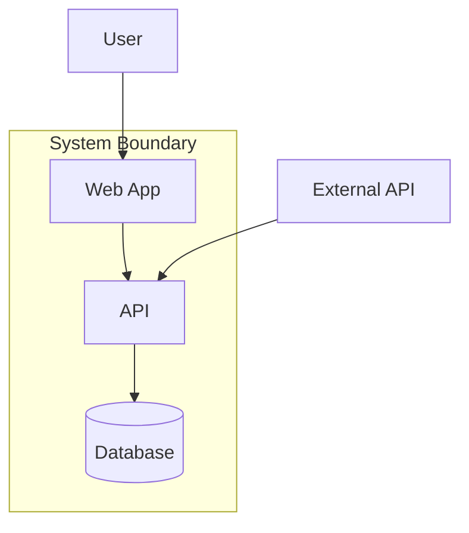

# Generate Diagrams Command

You are generating C4 architecture diagrams from analyzed subsystem data. Follow proper abstraction levels and notation conventions.

## Core Principle

**Diagrams communicate architecture. Wrong abstraction level = wrong understanding.**

Each C4 level serves a different audience. Don't mix levels in one diagram.

## C4 Diagram Levels

### Level 1: System Context

**Audience:** Everyone (technical and non-technical)
**Shows:** System as black box, external actors, external systems
**Hides:** Internal structure

```
┌─────────────────────────────────────────────────────────┐
│                    SYSTEM CONTEXT                        │
│                                                          │
│    ┌──────┐        ┌──────────────┐        ┌──────┐    │
│    │ User │───────▶│   [System]   │◀───────│ API  │    │
│    └──────┘        │              │        └──────┘    │
│                    │  Your system │                     │
│    ┌──────┐        │  as a box    │        ┌──────┐    │
│    │Admin │───────▶│              │◀───────│ DB   │    │
│    └──────┘        └──────────────┘        └──────┘    │
│                                                          │
└─────────────────────────────────────────────────────────┘
```

### Level 2: Container

**Audience:** Technical stakeholders
**Shows:** High-level technology choices, container relationships
**Hides:** Component details within containers

```
┌─────────────────────────────────────────────────────────┐
│                      CONTAINER                           │
│                                                          │
│    ┌─────────────┐    ┌─────────────┐    ┌──────────┐  │
│    │   Web App   │───▶│   API       │───▶│ Database │  │
│    │  (React)    │    │  (FastAPI)  │    │ (Postgres)│  │
│    └─────────────┘    └─────────────┘    └──────────┘  │
│           │                  │                          │
│           ▼                  ▼                          │
│    ┌─────────────┐    ┌─────────────┐                  │
│    │   Mobile    │    │   Worker    │                  │
│    │   (Flutter) │    │   (Celery)  │                  │
│    └─────────────┘    └─────────────┘                  │
│                                                          │
└─────────────────────────────────────────────────────────┘
```

### Level 3: Component

**Audience:** Developers
**Shows:** Components within a container, their responsibilities
**Hides:** Code-level details

```
┌─────────────────────────────────────────────────────────┐
│                 COMPONENT (API Container)                │
│                                                          │
│    ┌─────────────┐    ┌─────────────┐    ┌──────────┐  │
│    │   Auth      │───▶│   Users     │───▶│ Database │  │
│    │  Controller │    │   Service   │    │  Layer   │  │
│    └─────────────┘    └─────────────┘    └──────────┘  │
│           │                  ▲                          │
│           ▼                  │                          │
│    ┌─────────────┐    ┌─────────────┐                  │
│    │   Orders    │───▶│ Validation  │                  │
│    │  Controller │    │   Service   │                  │
│    └─────────────┘    └─────────────┘                  │
│                                                          │
└─────────────────────────────────────────────────────────┘
```

### Level 4: Code (Optional)

**Audience:** Developers working on specific component
**Shows:** Class diagrams, code structure
**When to use:** Only for complex components that need clarification

## Diagram Generation Process

### Step 1: Read Subsystem Catalog

Load `02-subsystem-catalog.md` and extract:
- Subsystem names and locations
- Dependencies (inbound/outbound)
- Key components
- Patterns observed

### Step 2: Determine Required Levels

| Deliverable Option | Diagram Levels |
|--------------------|----------------|
| Quick Overview (B) | Context + Container only |
| Full Analysis (A) | Context + Container + Component |
| Architect-Ready (C) | All levels + dependency flow |

### Step 3: Generate Context Diagram

From discovery findings, identify:
- External users/actors
- External systems
- System boundary

```markdown
## C4 Level 1: System Context

[ASCII diagram or Mermaid]

**Actors:**
- [Actor 1]: [Description, interaction]
- [Actor 2]: [Description, interaction]

**External Systems:**
- [System 1]: [Description, data flow]
- [System 2]: [Description, data flow]
```

### Step 4: Generate Container Diagram

From subsystem catalog, group into containers:

```markdown
## C4 Level 2: Container

[ASCII diagram or Mermaid]

**Containers:**
| Container | Technology | Responsibility |
|-----------|------------|----------------|
| [Name] | [Stack] | [One sentence] |

**Data Flows:**
- [Container A] → [Container B]: [Data description]
```

### Step 5: Generate Component Diagrams

For each significant container:

```markdown
## C4 Level 3: Component - [Container Name]

[ASCII diagram or Mermaid]

**Components:**
| Component | Type | Responsibility |
|-----------|------|----------------|
| [Name] | [Controller/Service/etc.] | [One sentence] |

**Dependencies:**
- [Component A] → [Component B]: [Reason]
```

## Notation Standards

### ASCII Diagrams

```
Boxes: ┌───────┐
       │ Name  │
       └───────┘

Arrows: ──▶ (data flow)
        ───  (relationship)
        - - ▶ (async/optional)

Boundaries: ╔═══════════════╗
            ║   Boundary    ║
            ╚═══════════════╝
```

### Mermaid Diagrams



## Validation Checklist

Before finalizing diagrams:

- [ ] Each level has correct abstraction (no mixing)
- [ ] All subsystems from catalog represented
- [ ] Dependencies match catalog's inbound/outbound
- [ ] External actors/systems identified
- [ ] Technology labels present (Container level)
- [ ] Arrows have direction and labels
- [ ] Legend explains notation if non-standard

## Output Format

Write to `03-diagrams.md`:

```markdown
# Architecture Diagrams

Generated from: `02-subsystem-catalog.md`
Date: [timestamp]
Confidence: [High/Medium/Low based on catalog confidence]

## C4 Level 1: System Context
[diagram + description]

## C4 Level 2: Container
[diagram + description]

## C4 Level 3: Component - [Container 1]
[diagram + description]

## C4 Level 3: Component - [Container 2]
[diagram + description]

## Diagram Limitations
- [Any gaps in source data]
- [Inferred relationships]
- [Unverified dependencies]
```

## Cross-Pack Discovery

```python
import glob

# For documentation formatting
writer_pack = glob.glob("plugins/muna-technical-writer/plugin.json")
if not writer_pack:
    print("Recommend: muna-technical-writer for professional formatting")
```

## Scope Boundaries

**This command covers:**
- C4 diagram generation (all 4 levels)
- Notation standards (ASCII/Mermaid)
- Abstraction level selection
- Diagram validation

**Not covered:**
- Subsystem analysis (use /analyze-codebase)
- Architecture assessment (use axiom-system-architect)
- Sequence diagrams (future enhancement)
