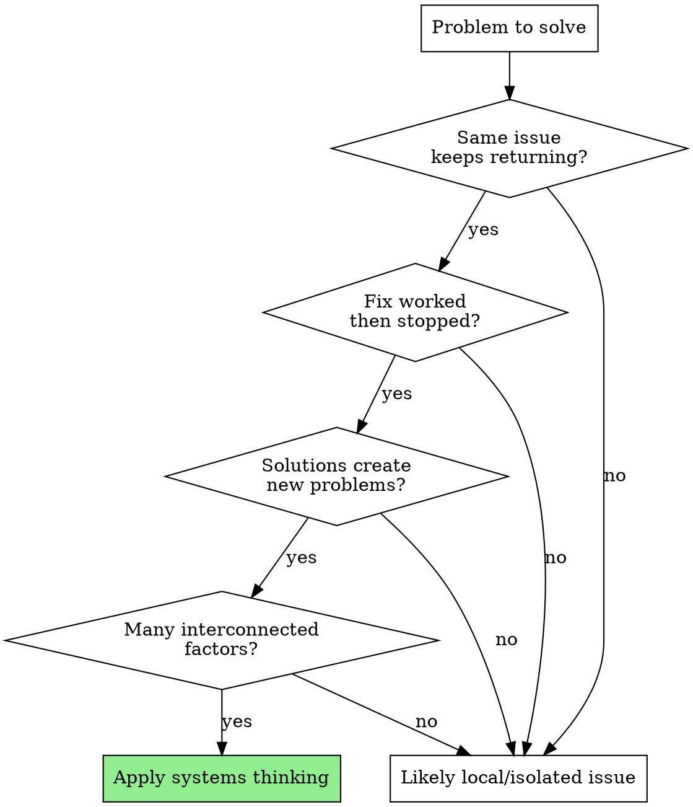

# Recognizing System Patterns

## Overview

**Systems thinking reveals invisible structures causing visible behaviors.** Most problems arise from system structure (feedback loops, delays, stocks/flows) rather than external forces or individual actions. Interventions failing despite good intentions signal systemic causes.

## When to Use



**Use when you see:**
- "It helped for a while, then got worse" (reinforcing loop)
- "We keep fighting the same problem" (symptom treatment)
- "The obvious solution made it worse" (unintended consequences)
- "Everything affects everything" (interconnected system)
- "No single cause" (emergent behavior)

**Don't use for:**
- Simple cause-and-effect problems
- Isolated technical bugs
- Problems with clear external causes

## System Archetypes (Pattern Matching)

Recognizing common structures saves analysis time:

| Archetype | Symptom | Structure | Example |
|-----------|---------|-----------|---------|
| **Fixes that Fail** | Solution works temporarily, problem returns | Reinforcing loop eventually dominates | Database indexes help, then data growth overwhelms them |
| **Shifting the Burden** | Symptom relief prevents real solution | Quick fix reduces pressure to solve root cause | Quality team fixes bugs so devs never improve |
| **Accidental Adversaries** | Well-intentioned actions hurt each other | Each side's solution worsens other's problem | API rate limits → users create multiple accounts → stricter limits |
| **Escalation** | Both sides increase efforts, making it worse | Reinforcing competition loop | Tech debt → pressure to go faster → more debt |
| **Tragedy of the Commons** | Individual optimization degrades shared resource | Many users, one depleting resource | Every team adds database queries, DB slows for all |

**When you recognize an archetype:** Jump directly to known leverage points for that pattern.

## Quick Reference: Analysis Checklist

When facing a complex problem:

- [ ] **Map causal structure** - What causes what? Draw the loops
- [ ] **Identify stocks and flows** - What accumulates? What's the rate of change?
- [ ] **Find feedback loops** - Reinforcing (amplifying)? Balancing (stabilizing)?
- [ ] **Spot delays** - How long between cause and effect?
- [ ] **Check for archetypes** - Does this match a common pattern?
- [ ] **Trace 2nd/3rd order effects** - Then what happens? And then?
- [ ] **Find leverage points** - Where does small effort create large change?

## Causal Loop Diagrams

**Simple notation for showing structure:**

```
[A] --+--> [B]     "A increases B" (same direction)
[A] ----> [B]

[A] ---o> [C]      "A decreases C" (opposite direction)

[B] --+--> [D] --+--> [B]    Reinforcing loop (R)
                             (more B → more D → more B)

[E] --+--> [F] ---o> [E]     Balancing loop (B)
                             (more E → more F → less E)
```

**Example: Code Quality Decline**

```
Technical Debt --+--> Time to Add Features ---o> Feature Velocity
       ^                                              |
       |                                              |
       +------------o---------------------------------+
                  (Pressure to Ship Faster)

              R: ESCALATION LOOP
```

This shows: Low velocity → pressure → cut corners → more debt → slower velocity → more pressure (reinforcing)

**Leverage point:** Break the loop by making debt VISIBLE and protecting time for reduction (see Meadows' "Information flows" leverage point).

## Stocks, Flows, and Delays

**Stocks** = What accumulates (technical debt, data size, user trust)
**Flows** = Rate of change (bug creation rate, data growth rate, churn rate)
**Delays** = Time between action and result

**Why this matters:**
- Stocks can't change instantly (you can't fix all tech debt today)
- Flows determine stock direction (reduce bug creation rate > fix existing bugs)
- Delays hide consequences (hire now, onboarding overhead hits in 3 months)

**Example: Performance Problem**

```
Stock: Total Data in Database
Inflow: Records Added per Day (growing)
Outflow: Records Archived per Day (zero)
Result: Database size grows unbounded → performance degrades

Leverage: Implement outflow (archival strategy)
```

## Leverage Points (Meadows' Hierarchy)

**Where to intervene** (most to least effective):

1. **Change system goals** - What is the system trying to do?
2. **Change paradigms** - How do we think about this?
3. **Add/change information flows** - Who knows what, when?
4. **Change rules** - Incentives, constraints, feedback
5. **Change structure** - Physical/organizational relationships
6. **Adjust flows** - Rates of change
7. **Adjust parameters** - Numbers in the system (least effective)

**Most people start at #7 (parameters) - least effective!**

**Example Application:**

Problem: API making too many requests

| Level | Intervention | Effectiveness |
|-------|--------------|---------------|
| Parameter | Set rate limit to 100/hour | Low - treats symptom |
| Flow | Add caching to reduce request rate | Medium |
| Structure | Add webhooks so clients don't need to poll | High |
| Information | Show users their call patterns/costs | High |
| Rules | Charge per API call above threshold | High |
| Paradigm | Rethink: "API is request-response" → "API is event-driven" | Highest |

## Predicting Unintended Consequences

**Ask three levels deep:**

1. **First order**: What happens immediately?
2. **Second order**: Then how do people change behavior?
3. **Third order**: Then what else changes?

**Example: Strict Code Review Requirements**

| Order | Effect |
|-------|--------|
| 1st | Code quality improves, fewer bugs |
| 2nd | Developers split PRs smaller to get faster reviews |
| 3rd | PRs become too small to understand context, review quality drops |

**Technique: Pre-mortem**
"It's 6 months from now. Our solution failed spectacularly. Why?"

## Red Flags - When to STOP and Apply Systems Thinking

If you catch yourself saying or thinking ANY of these, STOP immediately and map the system:

| Rationalization | Reality | What to Do |
|-----------------|---------|------------|
| "Too simple for systems thinking" | Simple-seeming problems often have systemic roots | Spend 5 minutes checking for archetypes |
| "I already know the answer" | Expertise creates blind spots to structure | Map one causal loop to verify |
| "No time for analysis" | Fast wrong action wastes more time than analysis | 10-minute system check prevents hours of rework |
| "Boss wants solution X" | Authority doesn't override system structure | Show data: "X addresses symptom, Y addresses cause" |
| "The obvious solution" | Obvious solutions often treat parameters not structure | Check leverage point level before implementing |
| "This worked before" | Systems change; yesterday's solution may worsen today's problem | Verify: What's different now? |
| "We just need to ship something" | Shipping wrong fix loses more time/trust than delay | Propose: "15 min diagnosis, then ship correct fix" |

**When under time pressure, systems thinking becomes MORE critical, not less.**

Quick wrong action compounds problems. Spending 10 minutes mapping the system often reveals 30-minute fixes that would have been overlooked in favor of 2-week wrong solutions.

## Common Mistakes

### ❌ Treating Symptoms Instead of Structure

**Symptom:** "Database is slow"
**Symptom treatment:** Add indexes, more RAM, faster hardware
**Structural fix:** Why is data growing unbounded? Add archival, change query patterns

### ❌ Optimizing Parts, Not System

**Example:** Each team optimizes their service latency, but system latency increases due to more service-to-service calls

### ❌ Missing Delays

**Example:** Hiring looks great month 1 (more hands), terrible months 2-4 (onboarding burden), good month 6+ (productivity)

### ❌ Fighting Feedback Loops

**Example:** More pressure to go fast → lower quality → slower velocity → more pressure (reinforcing). You can't win by "trying harder" - must break the loop

### ❌ Solving Problems at Wrong Level

**Example:** Adjusting rate limit numbers (parameter) instead of adding webhooks (structure change)

## Real-World Impact

**Performance debugging:** Recognizing "unbounded growth" pattern (stock with inflow, no outflow) immediately points to archival strategies instead of hardware scaling.

**Team dynamics:** Seeing "Shifting the Burden" archetype (quality team) reveals why feature quality never improves - the quick fix prevents real solution.

**Architecture decisions:** Using leverage point hierarchy shows why "add caching" (flow adjustment) is less effective than "add webhooks" (structure change).

## Related Patterns

- **Iceberg Model**: Events (what happened) → Patterns (trends) → Structure (system dynamics) → Mental Models (beliefs/assumptions)
- **Feedback dominance**: Systems shift which loop dominates over time
- **Emergence**: System behavior not predictable from individual parts
